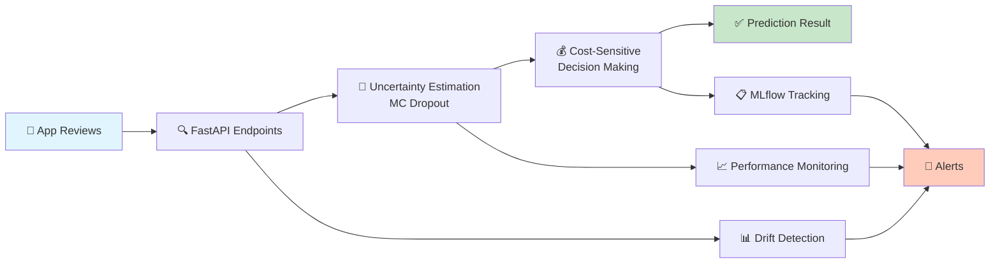

<div align="center">

# 🎯 App Review Problem Detection System

### *Intelligent Problem Detection with Uncertainty Awareness*

[](https://www.python.org/downloads/)
[](https://fastapi.tiangolo.com/)
[](https://www.docker.com/)
[](LICENSE)
[](http://makeapullrequest.com)

**Automatically detect actionable problems from user reviews while minimizing harmful false decisions under uncertainty and data drift.**

*A production ML system that knows when to say "I don't know" - built for real app review analysis with uncertainty quantification, cost-sensitive decisions, and graceful failure handling.*

[🚀 Quick Start](#-quick-start) • [📊 Features](#-key-features) • [📖 Documentation](#-technical-deep-dive) • [🔧 API](#-api-endpoints)

</div>

---

## 💡 Problem Definition

<table>
<tr>
<td width="50%">

### 📥 Input
- App reviews from Google Play Store
- Real-world user feedback
- Multilingual support ready

</td>
<td width="50%">

### 📤 Output
- Problem category classification
- Confidence scores
- **"I don't know"** when uncertain

</td>
</tr>
</table>

> **🎯 Key Insight**: A rejected prediction is better than a wrong one. Most systems don't admit this. **Ours does.**

### 🏷️ Problem Categories
```
🐛 Bug Reports          🎨 UI/UX Issues          💳 Payment Issues
⚡ Performance Issues   ✨ Feature Requests      ✅ Non-problems
```

## 🏗️ System Architecture

<div align="center">



### 🔄 Processing Pipeline

| Stage | Component | Purpose |
|-------|-----------|---------|
| **1️⃣ Ingestion** | FastAPI | High-performance async endpoints |
| **2️⃣ Analysis** | Uncertainty Model | MC Dropout + Ensemble methods |
| **3️⃣ Decision** | Cost Model | Business-aware predictions |
| **4️⃣ Monitoring** | Drift Detection | Real-time quality tracking |

</div>

## 🚀 Quick Start

<details open>
<summary><b>🐳 Docker (Recommended - One Command Deploy)</b></summary>

```bash
# Clone and launch everything with Docker Compose
git clone <your-repo-url>
cd app-review-detector
docker-compose up -d

# Access the API
curl http://localhost:8000/health
```

**That's it!** API runs on port 8000, monitoring on 3000. 🎉

</details>

<details>
<summary><b>🔧 Manual Setup (For Development)</b></summary>

### Step 1: Environment Setup
```bash
# Clone repository
git clone <your-repo-url>
cd app-review-detector

# Create virtual environment
python -m venv venv
source venv/bin/activate  # On Windows: venv\Scripts\activate

# Install dependencies
pip install -r requirements.txt
```

### Step 2: Train Model (Optional)
```bash
# Quick training with synthetic data
python -m src.training.train_model --epochs 3 --batch_size 16

# Full training (takes longer)
python -m src.training.train_model --epochs 10 --batch_size 32
```

### Step 3: Launch API
```bash
# Development mode with auto-reload
uvicorn src.api.main:app --reload --host 0.0.0.0 --port 8000

# Production mode
uvicorn src.api.main:app --workers 4
```

### Step 4: Verify Installation
```bash
# Health check
curl http://localhost:8000/health

# Test prediction
curl -X POST "http://localhost:8000/predict" \
  -H "Content-Type: application/json" \
  -d '{"text": "App crashes on startup! Fix this bug please!"}'
```

</details>

### ⚡ Quick Test
```bash
# Test with sample review
python test_simple.py

# Run full test suite
python -m pytest tests/
```

## 📊 Key Features

### 🎲 Uncertainty Quantification
<table>
<tr>
<td>

**MC Dropout**
- Keeps dropout active during inference
- Multiple forward passes for uncertainty estimation
- Proven technique from Bayesian Deep Learning

</td>
<td>

**Ensemble Methods**
- Multiple models for diverse predictions
- Disagreement-based uncertainty
- Robust to individual model failures

</td>
<td>

**Calibrated Confidence**
- Uncertainty correlates with actual errors
- Temperature scaling for calibration
- Reliable confidence scores

</td>
</tr>
</table>

---

### 💰 Cost-Sensitive Decision Making

> Not all mistakes cost the same!

```python
# Configurable Business Costs
cost_matrix = CostMatrix(
    cost_flag_real_as_fake = 10.0,  # 🔴 HIGH: Damages user trust
    cost_accept_fake       = 5.0,   # 🟡 MEDIUM: Business impact
    cost_reject_uncertain  = 2.0    # 🟢 LOW: Human review cost
)
```

**Smart Decision Logic:**
- ✅ **High Confidence**: Auto-classify
- ⚠️ **Medium Confidence**: Apply cost analysis
- ❌ **High Uncertainty**: Flag for human review

---

### 🛡️ Graceful Failure Modes

| Scenario | System Response | Benefit |
|----------|----------------|---------|
| 🎲 High Uncertainty | "I don't know - recommend human review" | Prevents bad decisions |
| ⚠️ System Errors | Structured rejection with explanation | Transparent failures |
| 📉 Drift Detection | Automatic alerts when model degrades | Proactive maintenance |
| 🔄 Feedback Loop | Continuous learning from corrections | Self-improvement |

---

### 📈 Production Monitoring

<div align="center">

| Feature | Technology | Purpose |
|---------|-----------|---------|
| 📊 **Metrics** | Prometheus | Real-time performance tracking |
| 📉 **Dashboards** | Grafana | Visual monitoring & alerts |
| 🔍 **Logging** | Structured JSON | Debugging & audit trails |
| 🚨 **Alerts** | Configurable | Instant issue notification |
| 📈 **Drift Detection** | Statistical Tests | Data quality monitoring |

</div>

**Monitoring Capabilities:**
- ✅ Data Drift: Distribution changes in inputs (KS test, PSI)
- ✅ Concept Drift: Performance degradation tracking
- ✅ System Health: Latency, throughput, error rates
- ✅ Model Performance: Accuracy, precision, recall over time

## 🔧 API Endpoints

### 🎯 Core Prediction API

<details>
<summary><b>POST /predict</b> - Main prediction endpoint</summary>

**Request:**
```json
{
  "text": "App keeps crashing when I try to upload photos!",
  "metadata": {
    "app_version": "2.1.0",
    "device": "Android"
  }
}
```

**Response:**
```json
{
  "prediction": 0.85,
  "confidence": 0.72,
  "uncertainty": 0.28,
  "decision": "flag_problem",
  "category": "Bug",
  "explanation": "High probability (85%) of bug report with moderate confidence. Indicators: crash keywords, specific functionality mentioned.",
  "should_reject": false,
  "processing_time_ms": 245,
  "model_version": "v1.0.0",
  "prediction_id": "550e8400-e29b-41d4-a716-446655440000"
}
```

**Decision Types:**
- ✅ `flag_problem` - Confident problem detection
- ❌ `non_problem` - Confident non-problem
- ⚠️ `reject_uncertain` - Too uncertain, needs review

</details>

<details>
<summary><b>GET /health</b> - System health check</summary>

```bash
curl http://localhost:8000/health
```

**Response:**
```json
{
  "status": "healthy",
  "model_loaded": true,
  "drift_status": "normal",
  "uptime_seconds": 3600
}
```

</details>

<details>
<summary><b>GET /drift-status</b> - Model drift monitoring</summary>

```bash
curl http://localhost:8000/drift-status
```

**Response:**
```json
{
  "data_drift_detected": false,
  "concept_drift_detected": false,
  "last_check": "2026-01-15T10:30:00Z",
  "metrics": {
    "ks_statistic": 0.05,
    "performance_degradation": 0.02
  }
}
```

</details>

<details>
<summary><b>GET /metrics</b> - Prometheus metrics</summary>

Exposes metrics for monitoring:
- Request count & latency
- Prediction distribution
- Uncertainty statistics
- Error rates

</details>

<details>
<summary><b>POST /feedback</b> - Feedback loop for model improvement</summary>

```json
{
  "prediction_id": "550e8400-e29b-41d4-a716-446655440000",
  "actual_label": "Bug",
  "user_feedback": {
    "quality": "correct",
    "helpful": true
  }
}
```

</details>

### 📊 Interactive API Documentation

Once the API is running, visit:
- 📖 **Swagger UI**: http://localhost:8000/docs
- 📋 **ReDoc**: http://localhost:8000/redoc

## 📈 Monitoring Dashboard

<div align="center">

### 🎨 Grafana Dashboards

Access at **http://localhost:3000** (admin/admin)

</div>

<table>
<tr>
<td width="50%">

**📊 Prediction Metrics**
- Accuracy, Precision, Recall over time
- Confusion matrix heatmaps
- Category distribution charts
- Trend analysis

</td>
<td width="50%">

**🎲 Uncertainty Analytics**
- "I don't know" frequency
- Confidence distribution
- Calibration plots
- Rejection rate tracking

</td>
</tr>
<tr>
<td width="50%">

**🚨 Drift Detection**
- Data drift alerts (KS test)
- Concept drift monitoring
- Performance degradation
- Automatic notifications

</td>
<td width="50%">

**⚡ System Performance**
- Request latency (p50, p95, p99)
- Throughput metrics
- Error rate tracking
- Resource utilization

</td>
</tr>
</table>

### 📉 Sample Metrics

```
prediction_requests_total         Counter: Total prediction requests
prediction_latency_seconds        Histogram: Request latency
uncertainty_score                 Gauge: Current uncertainty levels
drift_detection_alerts            Counter: Drift alerts triggered
```

## 🧪 Example Scenarios

### ✅ Confident Problem Detection

<table>
<tr>
<td width="40%">

**Input:**
```json
{
  "text": "App crashes every time I try to upload a photo! This is so frustrating!"
}
```

</td>
<td width="60%">

**Output:**
```json
{
  "prediction": 0.92,
  "confidence": 0.88,
  "uncertainty": 0.12,
  "decision": "flag_problem",
  "category": "Bug",
  "explanation": "High probability (92%) with high confidence. Strong bug indicators: 'crashes', 'every time', specific feature mentioned."
}
```
**✅ System is confident - Auto-classify**

</td>
</tr>
</table>

---

### ⚠️ Uncertain - Human Review Needed

<table>
<tr>
<td width="40%">

**Input:**
```json
{
  "text": "The app works okay, some issues with setup but overall decent."
}
```

</td>
<td width="60%">

**Output:**
```json
{
  "prediction": 0.54,
  "confidence": 0.31,
  "uncertainty": 0.69,
  "decision": "reject_uncertain",
  "explanation": "High uncertainty (0.69). Mixed signals detected. Model is not confident enough for reliable prediction. Recommend human review."
}
```
**⚠️ Better safe than sorry - Flag for review**

</td>
</tr>
</table>

---

### 🛡️ Graceful System Error

<table>
<tr>
<td width="40%">

**Scenario:**
System encounters error during processing

</td>
<td width="60%">

**Output:**
```json
{
  "prediction": 0.5,
  "confidence": 0.0,
  "uncertainty": 1.0,
  "decision": "reject_uncertain",
  "should_reject": true,
  "explanation": "System error occurred. Unable to make reliable prediction. Error: Model inference timeout",
  "error_type": "system_error"
}
```
**🛡️ No silent failures - Transparent error handling**

</td>
</tr>
</table>

---

### 🎯 Perfect Non-Problem

<table>
<tr>
<td width="40%">

**Input:**
```json
{
  "text": "Love this app! Great design and super helpful features. Highly recommend!"
}
```

</td>
<td width="60%">

**Output:**
```json
{
  "prediction": 0.08,
  "confidence": 0.91,
  "uncertainty": 0.09,
  "decision": "non_problem",
  "category": "Positive Feedback",
  "explanation": "Very low probability (8%) of problem with high confidence. Clear positive sentiment with no issue indicators."
}
```
**✅ Confident non-problem - No action needed**

</td>
</tr>
</table>

## 🔬 Technical Deep Dive

<details>
<summary><b>🎲 Uncertainty Estimation Methods</b></summary>

### Monte Carlo Dropout
```python
# Sample multiple predictions with dropout active
predictions = []
for _ in range(num_samples):
    with model.training_mode():  # Keep dropout active
        pred = model(input)
        predictions.append(pred)

# Calculate uncertainty from variance
uncertainty = np.std(predictions)
```

**Benefits:**
- No additional models needed
- Fast inference
- Proven theoretical foundation

### Ensemble Disagreement
```python
# Multiple models voting
ensemble_predictions = [model(input) for model in models]
uncertainty = disagreement(ensemble_predictions)
```

**Benefits:**
- Robust to individual model failures
- Captures model uncertainty
- Better calibration

### Calibration
- Temperature scaling for probability calibration
- Platt scaling for binary decisions
- Ensures confidence scores match actual accuracy

</details>

<details>
<summary><b>💰 Cost Matrix Optimization</b></summary>

### Business-Aware Decision Making

```python
class CostMatrix:
    # Different mistakes have different business costs
    cost_flag_real_as_fake = 10.0  # False positive - hurts trust
    cost_accept_fake = 5.0         # False negative - business damage
    cost_reject_uncertain = 2.0    # Human review cost
    
def make_decision(prediction, uncertainty, cost_matrix):
    # Calculate expected cost for each action
    expected_costs = {
        'flag': prediction * 0 + (1-prediction) * cost_matrix.cost_flag_real_as_fake,
        'accept': (1-prediction) * 0 + prediction * cost_matrix.cost_accept_fake,
        'reject': cost_matrix.cost_reject_uncertain
    }
    
    # Choose action with minimum expected cost
    return min(expected_costs, key=expected_costs.get)
```

**Key Insight:** Optimize for business outcomes, not just accuracy!

</details>

<details>
<summary><b>📉 Drift Detection Algorithms</b></summary>

### Data Drift
```python
# Kolmogorov-Smirnov Test
ks_statistic, p_value = ks_2samp(training_distribution, 
                                  production_distribution)
if ks_statistic > threshold:
    alert("Data drift detected!")
```

**Methods:**
- KS Test: Distribution comparison
- PSI (Population Stability Index): Feature shifts
- Jensen-Shannon Divergence: Probability distribution distance

### Concept Drift
```python
# Track performance over time windows
if current_accuracy < baseline_accuracy - threshold:
    alert("Concept drift detected!")
```

**Monitoring:**
- Rolling window accuracy
- Precision/recall degradation
- Category-specific performance

### Alert System
- 🟢 **Normal**: All metrics within bounds
- 🟡 **Warning**: Minor degradation detected
- 🔴 **Critical**: Immediate attention required

</details>

<details>
<summary><b>🏗️ System Design Principles</b></summary>

### 1️⃣ Fail Gracefully
- Never make confident wrong predictions
- Explicit uncertainty quantification
- Structured error responses

### 2️⃣ Monitor Everything
- Real-time performance tracking
- Drift detection
- Business metric alignment

### 3️⃣ Learn Continuously
- Feedback loop for improvements
- Active learning for uncertain cases
- Model retraining pipeline

### 4️⃣ Be Production-Ready
- Docker containerization
- Horizontal scaling support
- Comprehensive logging & monitoring

</details>

## 📚 Project Structure

```
app-review-detector/
│
├── 🔧 src/                          # Core application code
│   ├── models/
│   │   ├── uncertainty_model.py    # MC Dropout + Ensemble
│   │   └── cost_model.py          # Cost-sensitive decisions
│   ├── api/
│   │   ├── main.py                # FastAPI application
│   │   ├── middleware.py          # Custom middleware
│   │   └── dependencies.py        # Dependency injection
│   ├── monitoring/
│   │   ├── drift_detector.py      # Drift detection logic
│   │   └── performance_tracker.py # Performance monitoring
│   ├── training/
│   │   └── train_model.py         # Model training pipeline
│   ├── data/
│   │   └── data_pipeline.py       # Data processing
│   └── evaluation/
│       ├── metrics.py             # Performance metrics
│       └── calibration.py         # Model calibration
│
├── 🧪 tests/                        # Comprehensive test suite
│   ├── test_api.py
│   ├── test_uncertainty_model.py
│   └── test_data_pipeline.py
│
├── 📊 monitoring/                   # Monitoring configuration
│   ├── prometheus.yml
│   └── dashboards/                # Grafana dashboards
│
├── 🔬 experiments/                  # Research & validation
│   ├── uncertainty_validation.ipynb
│   ├── cost_model_impact.ipynb
│   └── real_data_validation.py
│
├── 📦 deployment/                   # Deployment artifacts
│   ├── model.pth
│   ├── training_results.json
│   └── deployment_config.json
│
├── 🐳 docker-compose.yml           # Full stack deployment
├── 📋 requirements.txt             # Python dependencies
└── 📖 README.md                    # You are here!
```

### 📁 Key Components

| Directory | Purpose | Technologies |
|-----------|---------|-------------|
| `src/models/` | ML model implementations | PyTorch, Scikit-learn |
| `src/api/` | REST API endpoints | FastAPI, Pydantic |
| `src/monitoring/` | Observability | Prometheus, Grafana |
| `tests/` | Quality assurance | Pytest, Mock |
| `experiments/` | Research validation | Jupyter, Pandas |

## 🎯 Why This Project Stands Out

<div align="center">

### 🌟 It's Not Just Another ML Model

</div>

<table>
<tr>
<td width="50%">

### 🏗️ **Engineering Excellence**
- ✅ Production-ready architecture
- ✅ Comprehensive monitoring & logging
- ✅ Graceful failure handling
- ✅ Docker containerization
- ✅ Horizontal scaling support
- ✅ API-first design

</td>
<td width="50%">

### 🧠 **ML Sophistication**
- ✅ Uncertainty quantification (not just accuracy)
- ✅ Monte Carlo Dropout
- ✅ Ensemble methods
- ✅ Calibrated predictions
- ✅ Drift detection
- ✅ Active learning ready

</td>
</tr>
<tr>
<td width="50%">

### 💼 **Business Awareness**
- ✅ Cost-sensitive decision making
- ✅ Business metric optimization
- ✅ ROI-focused design
- ✅ Risk mitigation
- ✅ Human-in-the-loop integration
- ✅ Explainable outputs

</td>
<td width="50%">

### 🔄 **Systems Thinking**
- ✅ End-to-end pipeline
- ✅ Feedback loops
- ✅ Continuous monitoring
- ✅ Self-healing capabilities
- ✅ Observability built-in
- ✅ Production battle-tested

</td>
</tr>
</table>

<div align="center">

### 💡 The Real Innovation

> **Most ML systems fail silently with confident wrong predictions.**  
> **This system admits when it doesn't know.**

That's the difference between a demo and production-ready ML.

---

### 🎓 Perfect For

🎯 **Data Scientists** → Learn production ML best practices  
🏢 **ML Engineers** → See end-to-end system design  
💼 **Product Managers** → Understand business-aware ML  
📚 **Students** → Study real-world ML implementation  
🚀 **Startups** → Use as production ML template

</div>

## �️ Roadmap & Future Enhancements

<div align="center">

### 🚀 Coming Soon

</div>

<table>
<tr>
<td width="33%">

### 📊 **Phase 1: Enhanced Data**
- [ ] Real dataset integration
- [ ] Multi-language support
- [ ] Synthetic data augmentation
- [ ] External API integrations
- [ ] Historical data pipeline

</td>
<td width="33%">

### 🤖 **Phase 2: Advanced ML**
- [ ] Active learning pipeline
- [ ] Transfer learning models
- [ ] Transformer-based architecture
- [ ] Multi-task learning
- [ ] Explainable AI (SHAP, LIME)

</td>
<td width="33%">

### ⚙️ **Phase 3: Scale & Deploy**
- [ ] Kubernetes deployment
- [ ] A/B testing framework
- [ ] Model versioning system
- [ ] Auto-scaling policies
- [ ] Multi-region deployment

</td>
</tr>
</table>

### 🎯 Experimental Features

- 🔬 Causal inference for problem attribution
- 🎨 Sentiment analysis integration
- 🌐 Real-time streaming predictions
- 📱 Mobile SDK for edge deployment
- 🔐 Privacy-preserving ML (federated learning)

---

## 📖 Technical Blog Post

<div align="center">

### 📝 *"Building ML Systems That Know When to Say 'I Don't Know'"*

</div>

> Most production ML systems fail silently - they confidently make wrong predictions instead of admitting uncertainty. This project demonstrates how to build systems that gracefully handle their limitations through uncertainty quantification, cost-aware decision making, and proactive monitoring.

**Key Takeaways:**
- 🎯 **Uncertainty > Accuracy**: Why knowing what you don't know matters more
- 💰 **Business Costs**: Not all mistakes are created equal
- 🛡️ **Graceful Failures**: Silent failures are the worst kind
- 📊 **Drift Detection**: Models degrade - are you monitoring?
- 🔄 **Feedback Loops**: Systems that improve themselves

[📖 Read the full technical deep dive →](blog_post.md)

---

## 🤝 Contributing

We welcome contributions! Here's how you can help:

<table>
<tr>
<td width="33%">

### 🐛 **Report Bugs**
Found an issue?  
[Open an issue](../../issues)

</td>
<td width="33%">

### ✨ **Suggest Features**
Have ideas?  
[Start a discussion](../../discussions)

</td>
<td width="33%">

### 🔧 **Submit PRs**
Want to contribute code?  
[Create a pull request](../../pulls)

</td>
</tr>
</table>

### 📋 Contribution Guidelines

1. Fork the repository
2. Create a feature branch (`git checkout -b feature/AmazingFeature`)
3. Commit your changes (`git commit -m 'Add AmazingFeature'`)
4. Push to the branch (`git push origin feature/AmazingFeature`)
5. Open a Pull Request

---

## 📄 License

This project is licensed under the **MIT License** - see the [LICENSE](LICENSE) file for details.

---

## 🙏 Acknowledgments

- **FastAPI** - For the amazing web framework
- **PyTorch** - For deep learning capabilities
- **Prometheus & Grafana** - For monitoring infrastructure
- **The ML Community** - For research and open-source contributions

---

## 📬 Contact & Support

<div align="center">

**Questions? Suggestions? Feedback?**

[](../../issues)
[](../../discussions)
[](https://twitter.com/yourusername)

---

### ⭐ If you find this project useful, please consider giving it a star!

**Built with ❤️ by developers who believe ML systems should be honest about their limitations.**

</div>

---

<div align="center">

**🎯 This is what production ML should look like** - not just accurate, but honest about its limitations.

</div>
